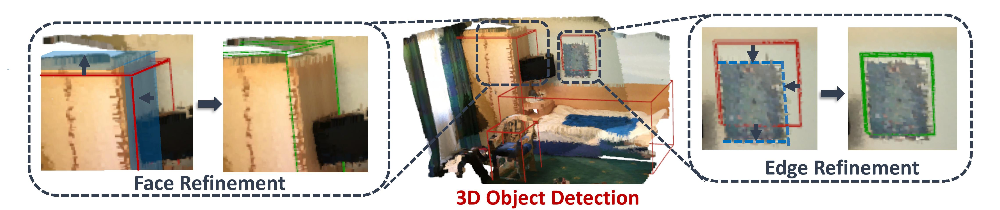

# H3DNet: 3D Object Detection Using Hybrid Geometric Primitives
Created by <a href="https://sites.google.com/a/utexas.edu/zaiwei-zhang/" target="_blank">Zaiwei Zhang</a>, <a href="https://yanghtr.github.io/" target="_blank">Haitao Yang</a>, <a href="https://sites.google.com/view/bosun/home" target="_blank">Bo Sun</a> and <a href="https://www.cs.utexas.edu/~huangqx/" target="_blank">Qixing Huang</a>.

## Introduction
This repository is code release for our paper (arXiv report [here](https://arxiv.org/abs/2006.05682)).

We introduce H3DNet, which takes a colorless 3D point cloud as input and outputs a collection of oriented object bounding boxes (or BB) and their semantic labels. The critical idea of H3DNet is to predict a hybrid set of geometric primitives, i.e., BB centers, BB face centers, and BB edge centers. We show how to convert the predicted geometric primitives into object proposals by defining a distance function between an object and the geometric primitives. This distance function enables continuous optimization of object proposals, and its local minimums provide high-fidelity object proposals. H3DNet then utilizes a matching and refinement module to classify object proposals into detected objects and fine-tune the geometric parameters of the detected objects. The hybrid set of geometric primitives not only provides more accurate signals for object detection than using a single type of geometric primitives, but it also provides an overcomplete set of constraints on the resulting 3D layout. Therefore, H3DNet can tolerate outliers in predicted geometric primitives. Our model achieves state-of-the-art 3D detection results, with only pointclouds input, on two large datasets with real 3D scans, ScanNet and SUN RGB-D.

In this repository, we provide H3DNet model implementation (with Pytorch) as well as data preparation, training and evaluation scripts on SUN RGB-D and ScanNet. Since our model is built on <a href="https://github.com/facebookresearch/votenet" target="_blank">VoteNet</a>, we borrowed a lot of codes from their codebase.

## Installation

Since we are built on top of VoteNet, we require similar packages before using our code. Install [Pytorch](https://pytorch.org/get-started/locally/) and [Tensorflow](https://github.com/tensorflow/tensorflow) (for TensorBoard). It is required that you have access to GPUs. Matlab is required to prepare data for SUN RGB-D. The code is tested with Ubuntu 18.04, Pytorch v1.1, TensorFlow v1.14, CUDA 10.0 and cuDNN v7.4.

Compile the CUDA layers for [PointNet++](http://arxiv.org/abs/1706.02413), which we used in the backbone network:

    cd pointnet2
    python setup.py install

Install the following Python dependencies (with `pip install`):

    numpy
    matplotlib
    scipy
    sklearn
    opencv-python
    plyfile
    pytorch=1.1.0
    tensorflow-gpu==1.12.0 (only for visualization)
    'trimesh>=2.35.39,<2.35.40'
    'networkx>=2.2,<2.3'

## Training and evaluating

### Data preparation

For data preparation, we share the same data pre-processing steps with VoteNet. We provide the processed training and testing data for SUN RGB-D [here](https://drive.google.com/file/d/1P_uFQcvVFf10TLxjIaFMfjto8ZHON-N2/view?usp=sharing), and for ScanNet [here](https://drive.google.com/file/d/13-LyTx4ftVreHmzQMM3MQDgAB3jKB7Sg/view?usp=sharing).

### Train and test on SUN RGB-D

To train a new H3DNet model on SUN RGB-D data (depth images):

    python train.py --data_path path/to/sunrgbd --dataset sunrgbd --log_dir log_sunrgbd --num_point 40000 --model hdnet --batch_size 16
  
In order to train in batch_size 16, you will have to use at least 3/4 GPUs. You can use `CUDA_VISIBLE_DEVICES=0,1,2` to specify which GPU(s) to use. Without specifying CUDA devices, the training will use all the available GPUs and train with data parallel.
While training you can check the `log_sunrgbd/log_train.txt` file on its progress, or use the TensorBoard to see loss curves.

To run H3DNet with one backbone (less memory):

    python train_1bb.py --data_path path/to/sunrgbd --dataset sunrgbd --log_dir log_sunrgbd --num_point 40000 --model hdnet_1bb --batch_size 16

You can set the pretrained-weight using --pre_checkpoint_path flag. You can use the pretrained weight in [here](https://github.com/facebookresearch/DepthContrast). Please set the scale of the backbone using --scale accordingly. Use pretrained weight with scale 3 should achieve around 63.5 mAP@0.25.

To test the trained model with its checkpoint:

    python eval.py --data_path path/to/sunrgbd --dataset sunrgbd --model hdnet --checkpoint_path path/to/checkpoint --dump_dir eval_sunrgbd --cluster_sampling seed_fps --use_3d_nms --use_cls_nms --per_class_proposal

Example results will be dumped in the `eval_sunrgbd` folder (or any other folder you specify). You can run `python eval.py -h` to see the full options for evaluation. After the evaluation, you can use MeshLab to visualize the predicted votes and 3D bounding boxes (select wireframe mode to view the boxes). Final evaluation results will be printed on screen and also written in the `log_eval.txt` file under the dump directory. In default we evaluate with both AP@0.25 and AP@0.5 with 3D IoU on oriented boxes. A properly trained H3DNet should have around 60 mAP@0.25 and 39 mAP@0.5.

### Train and test on ScanNet

To train a H3DNet model on Scannet data (fused scan):

    python train.py --data_path path/to/scannet_train_detection_data --dataset scannet --log_dir log_scannet --num_point 40000 --model hdnet --batch_size 8

To run H3DNet with one backbone (less memory):

    python train_1bb.py --data_path path/to/scannet_train_detection_data --dataset scannet --log_dir log_scannet --num_point 40000 --model hdnet_1bb --batch_size 8

It should provide 66 mAP@0.25 with training from scratch. You can set the pretrained-weight using --pre_checkpoint_path flag. You can use the pretrained weight in [here](https://github.com/facebookresearch/DepthContrast). Please set the scale of the backbone using --scale accordingly. Use pretrained weight with scale 3 should achieve around 69.0 mAP@0.25.

To test the trained model with its checkpoint:

    python eval.py --data_path path/to/scannet_train_detection_data --dataset scannet --model hdnet --checkpoint_path path/to/checkpoint --dump_dir eval_scannet --num_point 40000 --cluster_sampling seed_fps --use_3d_nms --use_cls_nms --per_class_proposal

Example results will be dumped in the `eval_scannet` folder (or any other folder you specify). In default we evaluate with both AP@0.25 and AP@0.5 with 3D IoU on axis aligned boxes. A properly trained H3DNet should have around 67 mAP@0.25 and 48 mAP@0.5.

### Visualize predictions and ground truths 
Visualization codes for ScanNet and SUN RGB-D are in `utils/show_results_scannet.py` and `utils/show_results_sunrgbd.py` saparately. 

Before running them, you should change the data paths in the beginning of each script. 

To visualize ground truth scenes and bounding boxes of ScanNet, run 

    python show_results_scannet.py gt

To visualize ground truth scenes and bounding boxes of ScanNet, run 

    python show_results_scannet.py pred

Usages for SUN RGB-D are just replacing scripts with args unchanged. 
## License
H3DNet is relased under the MIT License. See the LICENSE file for more details.
